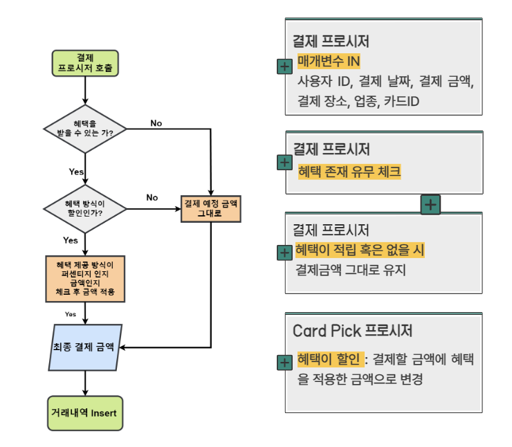

# 손님 맞춤형 카드 혜택 추천 플랫폼, 하나OnePick
# 1. 프로젝트 개요

## 1-1. 프로젝트 배경


- 요즘 '베테크'가 주목을 받고 있습니다. 베테크(Benefit + 재테크)란 혜택으로 재테크를 한다는 의미로 , 기업이 제공하는 각종 맞춤형 할인 혜택을 활용하는 것을 뜻합니다. 실제로 한 카드사가 개인 맞춤형 서비스 '#마이태그' 를 제공하며 이용자수가 2년 사이 190% 증가했습니다. 그만큼 '베테크'를 활용하는 사람이 많이 늘었다는 것을 확인할 수 있습니다
- 지난해 코로나19 사태 여파로 경제 상황 어려움이 지속되는 가운데 우리나라 국민 1인당 신용카드 보유량은 늘어났습니다. 1인당 신용카드 보유량도 4.4장으로 전년보다 0.2장 증가했습니다. 지난 2012년에 기록한 4.5장 이후 가장 많은 수치라고 합니다.

## 1-2. 프로젝트 목적

- 본 프로젝트는 베테크를 하는 손님들, 카드가 많아 결제 시 선택을 고민하는 손님들을 위한 맞춤형 카드 서비스 필요하다고 생각했습니다.
- 손님들에게 맞춤형 서비스를 제공 하며 결제 시 유리한 카드를 추천 및 손쉬운 실적 관리를 통해 합리적인 소비를 도울 것입니다.
- 손님의 위치와 보유 카드를 기반으로 주변 가맹점의 혜택 정보를 제공합니다.

## 1-3. 타사 기능 비교


## 1-4. 프로젝트 제안서

## 1-5. 개발환경

```
- OS : Window11, Ubuntu Linux 20.04
- Framework : Spring Boot
- Server : tomcat9
- Tool : Eclipse, Sql Developer, IntelliJ, Github
- DBMS : Oracle DBMS
- Cloud : Azure
```

# 2. 프로젝트 일정


# 3. 프로젝트 결과

최종 발표 PPT

## 3-1. 주요 기능


## 3-2. 카드 혜택

하나 카드에서 제공하는 카드 29개를 (신용카드 + 체크카드) 데이터베이스에 카드 이름, 카드 부연 설명, 연회비, 전월 실적 등을 입력해두었습니다. 또한 혜택을 데이터베이스 따로 관리해보았습니다.

데이터베이스에 카드 혜택을 카드 상품 ID, 카드 실적, 혜택 코드, 업종 코드, 업종명, 혜택제공량, 혜택한도를 입력했습니다. 혜택을 카드 상품별, 실적별로 관리했습니다. 또한 카드 혜택 제공량과 혜택 한도에 대한 다양한 조건의 처리는 혜택 코드를 통해 구분해보았습니다.


 

## 3-3. 데이터 생성

본 프로젝트의 기능 중 사용자의 1년의 소비내역을 토대로 같은 거래내역에 다른 카드를 적용했을 시에 지금보다 더 많은 혜택을 받을 수 있는 카드를 추천해주는 기능이 있습니다. 이에 하나 OnePick을 1년간 사용했다는 가정의 소비내역 데이터가 필요했습니다. 따라서 PL/SQL 프로시저를 통해 결제에 유리한 카드를 고르고 혜택 방식에 맞는 결제를 해서 거래내역 테이블에 INSERT 하면서 소비내역 데이터를 생성하였습니다.

### 3-3-1. 카드 선택 PL/SQL 프로시저 흐름도


### 3-3-2. 결제 PL/SQL 프로시저 흐름도


## 3-4. 적용 기술


## 4. 아키텍쳐

### 4-1. 시스템 아키텍쳐


### 4-2. 서비스 아키텍쳐


 

## 5. ERD


## 6. 본인 소개

|구분|내용|비고|
|---|---|---|
|이름|최경민||
|연락처|ckm45@naver.com||
|Frontend skill|HTML, CSS, Javascript||
|Backend skill|Java, Spring, Oracle||
|자격증| 정보처리기사 | 2022.11 |
|| OPIc(영어, IM1) | 2022. 09 |
|| 리눅스마스터 2급 | 2022. 12 |
|대외활동|교내 캡스톤 디자인 (사용자 맞춤형 축구화 추천 어플리케이션)|2022년 09월 ~ 2022년 11월|
|교육활동|하나금융티아이 채용전환형 교육 1200시간( 한국폴리텍대학교 광명융합기술교육원 - 데이터분석과 )|2023년 03월 ~ 2023년 10월|
